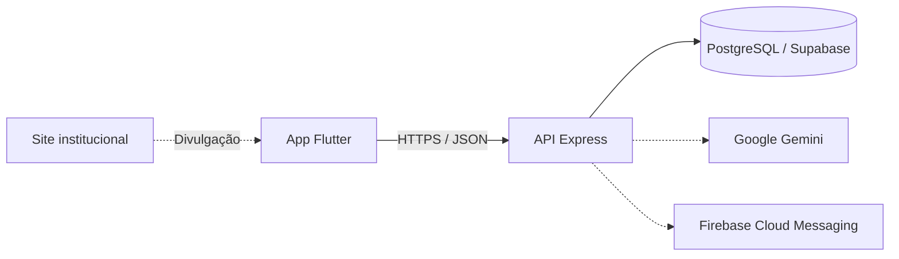

<div align="center">
  
  <h1>Ello</h1>
  <p><strong>Cuidado conectado, rotina organizada e mais tranquilidade para toda a família.</strong></p>
  <p>
    Aplicativo para apoiar o cuidado de pessoas idosas, reunindo saúde, medicamentos,<br />
    agenda, comunicação familiar e relatórios em um só lugar.
  </p>
  <p>
    <a href="https://github.com/CaioOlliveira/Ello_TCC/actions/workflows/ci.yml"></a>
    <a href="https://site-ello-rho.vercel.app"></a>
    
    
  </p>
</div>

## Sobre o projeto

O Ello nasceu como Trabalho de Conclusão de Curso (TCC) para simplificar a rotina de cuidado. O aplicativo conecta cuidadores e familiares a uma mesma ficha, centralizando informações importantes e oferecendo uma visão clara do dia a dia da pessoa idosa.

### Principais funcionalidades

- cadastro de pessoas idosas, familiares, cuidadores e permissões;
- acompanhamento de pressão, glicemia, oxigenação, temperatura, alimentação, hidratação, sono e humor;
- controle de medicamentos, agenda e lembretes;
- gestão de insumos, equipamentos e gastos;
- histórico de cuidados e geração de relatórios;
- chat familiar com notificações;
- assistente Cora, com recursos de inteligência artificial;
- acesso por convite e QR Code.

## Tecnologias

<div align="center">
  
  
  
  
  
  
  
  
  
  
  
</div>

| Camada      | Tecnologias                                       |
| ----------- | ------------------------------------------------- |
| Aplicativo  | Flutter, Dart, Riverpod, GoRouter e Dio           |
| API         | Node.js, TypeScript, Express e Zod                |
| Site        | HTML5 e CSS3                                      |
| Dados       | PostgreSQL hospedado no Supabase                  |
| Integrações | Firebase Cloud Messaging, Google Sign-In e Gemini |
| Qualidade   | Vitest, Supertest, ESLint e Flutter Test          |
| Deploy      | Docker, Railway e Vercel                          |

## Arquitetura



O repositório é um monorepo: o aplicativo fica em `mobile/`, a API em `backend/` e o site institucional em `site/`. A API expõe endpoints REST sob o prefixo `/api/v1` e, sem `DATABASE_URL`, parte dos módulos utiliza dados em memória para facilitar o desenvolvimento.

## Como executar

### Pré-requisitos

- [Flutter](https://docs.flutter.dev/get-started/install) 3.41 ou superior;
- Node.js 24 ou superior;
- npm;
- PostgreSQL/Supabase, opcional para a execução inicial.

### 1. Clone o repositório

```bash
git clone https://github.com/CaioOlliveira/Ello_TCC.git
cd Ello_TCC
```

### 2. Inicie a API

```bash
cd backend
cp .env.example .env
npm ci
npm run dev
```

A API estará disponível em `http://localhost:3000/api/v1`. Confira com:

```http
GET http://localhost:3000/api/v1/health
```

As integrações externas são opcionais no desenvolvimento local. Preencha no arquivo `backend/.env` somente as variáveis necessárias:

| Variável                        | Uso                                                       |
| ------------------------------- | --------------------------------------------------------- |
| `DATABASE_URL`                  | conexão da API com o PostgreSQL                           |
| `DIRECT_URL`                    | conexão direta para operações administrativas e migrações |
| `AUTH_TOKEN_SECRET`             | assinatura dos tokens de sessão                           |
| `GOOGLE_CLIENT_IDS`             | autenticação com Google                                   |
| `GEMINI_API_KEY`                | recursos da assistente Cora                               |
| `FIREBASE_SERVICE_ACCOUNT_JSON` | notificações push                                         |

> Nunca envie o arquivo `.env` ou chaves reais para o GitHub.

### 3. Inicie o aplicativo

Em outro terminal:

```bash
cd mobile
flutter pub get
flutter run --dart-define=API_BASE_URL=http://10.0.2.2:3000/api/v1
```

No emulador Android, `10.0.2.2` aponta para o `localhost` do computador. Em um aparelho físico, substitua esse endereço pelo IP local da máquina. Sem o `--dart-define`, o aplicativo usa a API publicada configurada no projeto.

### 4. Visualize o site institucional

```bash
cd ..
python -m http.server 4173 --directory site
```

Abra `http://localhost:4173`. As instruções de publicação estão no [README do site](./site/README.md).

## Testes e qualidade

```bash
# API
cd backend
npm run lint
npm test
npm run build

# Aplicativo
cd ../mobile
flutter analyze
flutter test
```

O workflow de CI executa essas verificações automaticamente em pushes e pull requests para a branch `main`.

## Estrutura do repositório

```text
Ello_TCC/
├── backend/             # API REST em Node.js e TypeScript
│   ├── src/modules/     # módulos de domínio da API
│   ├── sql/             # scripts de evolução do banco
│   └── tests/           # testes automatizados
├── mobile/              # aplicativo Flutter
│   ├── lib/features/    # funcionalidades do aplicativo
│   └── test/            # testes Flutter
├── site/                # landing page institucional publicada no Vercel
├── docs/                # arquitetura e guias técnicos
├── .github/workflows/   # integração contínua
└── README.md
```

## Documentação

- [Arquitetura](./docs/arquitetura.md)
- [Guia da API para Postman](./docs/api-postman.md)
- [Chat e notificações](./docs/chat-notificacoes.md)
- [Site e publicação no Vercel](./site/README.md)
- [Como contribuir](./CONTRIBUTING.md)

## Versionamento

O projeto segue [Versionamento Semântico](https://semver.org/lang/pt-BR/) no formato `MAJOR.MINOR.PATCH`. A versão atual é `0.1.0`, ainda em desenvolvimento inicial. Consulte o guia de contribuição para o fluxo de branches, commits e releases.

---

<div align="center">
  Desenvolvido como projeto de TCC com foco em tecnologia para o cuidado.
</div>
