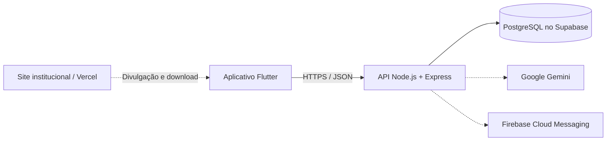

# Arquitetura

O Ello é organizado como um monorepo com três componentes: o cliente Flutter em `mobile/`, a API REST em `backend/` e a landing page institucional em `site/`.



## Aplicativo

O Flutter centraliza tema, rotas e providers em `lib/app`. As funcionalidades ficam separadas em `lib/features`, enquanto integrações compartilhadas, autenticação, notificações e acesso HTTP ficam em `lib/core`.

O aplicativo usa Riverpod para estado, GoRouter para navegação e Dio para comunicação com a API. A URL da API é definida em tempo de compilação com `API_BASE_URL`.

## Site institucional

A pasta `site/` contém uma landing page estática em HTML e CSS. Ela concentra os links de download, formulários da pesquisa, Instagram e GitHub do projeto. No Vercel, essa pasta deve ser configurada como **Root Directory**.

## API

A API usa Express, TypeScript e rotas modulares sob o prefixo `/api/v1`. Zod valida as entradas e middlewares centralizam autenticação, tratamento de erros e respostas para rotas inexistentes.

Os módulos ficam em `src/modules`, geralmente separados em rotas, controllers, services e schemas. A autenticação suporta credenciais e Google Sign-In, com tokens de sessão assinados pela API.

## Dados e integrações

Quando `DATABASE_URL` está configurada, os serviços acessam diretamente o PostgreSQL hospedado no Supabase por meio do driver `pg`. Alguns fluxos têm fallback em memória sem banco, útil para testes e desenvolvimento inicial.

Integrações opcionais:

- Google Gemini para os recursos da assistente Cora;
- Firebase Cloud Messaging para notificações push;
- Railway para hospedagem da API.

## Execução local

```bash
# API
cd backend
cp .env.example .env
npm ci
npm run dev

# Aplicativo, em outro terminal
cd mobile
flutter pub get
flutter run --dart-define=API_BASE_URL=http://10.0.2.2:3000/api/v1
```
